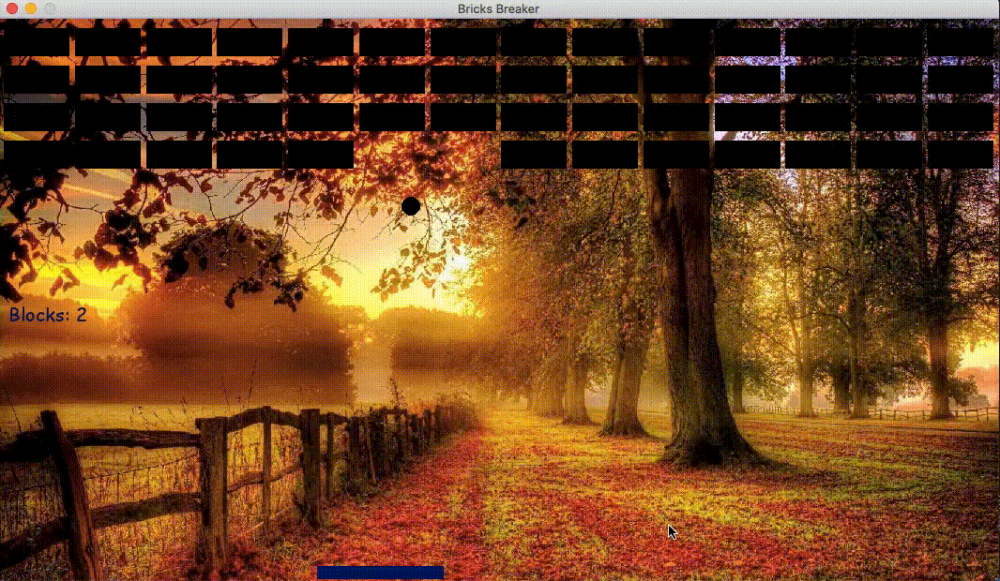

# Break-Breaker




# Instructions 
1. Make sure you have Python-3 installed and working 
2. Clone the repository on your machine by clicking in the command line: 
git clone ```https://github.com/tal-weisblat/Brick-Breaker.git```
3. Install prerequisites using pip (or pip3) 
4. Run <i>game.py</i> to run the application 


# Game Controls 

* Right arrow --> Move paddle to the right 

* Left arrow --> Move paddle to the left 

* Space bar --> shooting 

